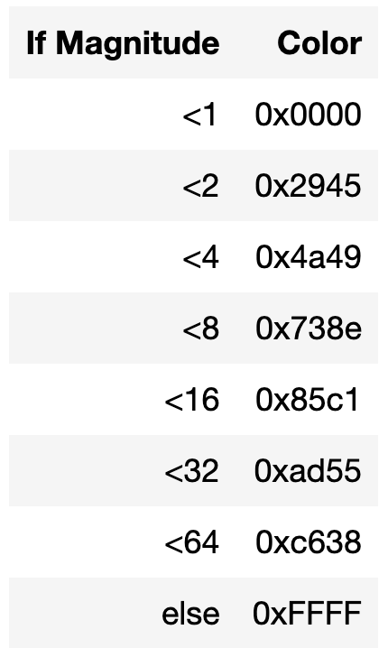
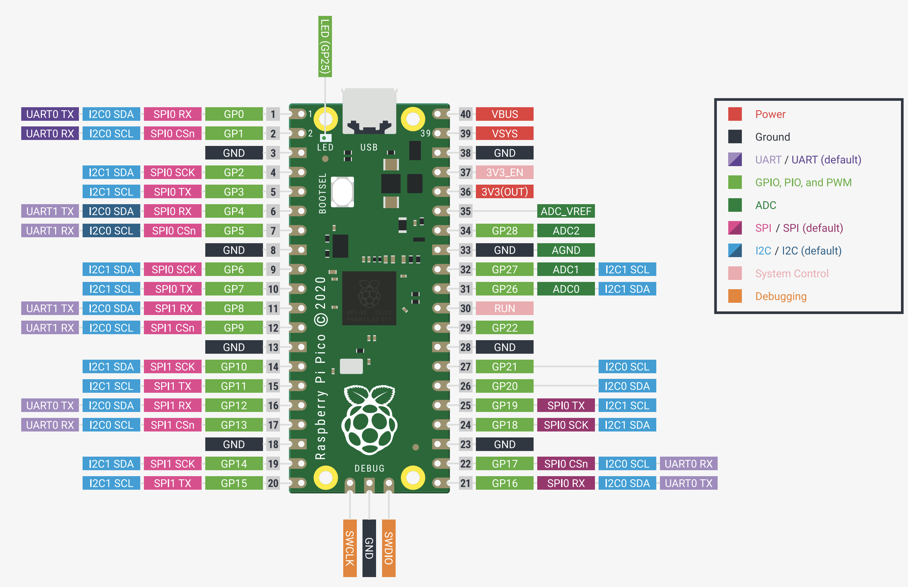
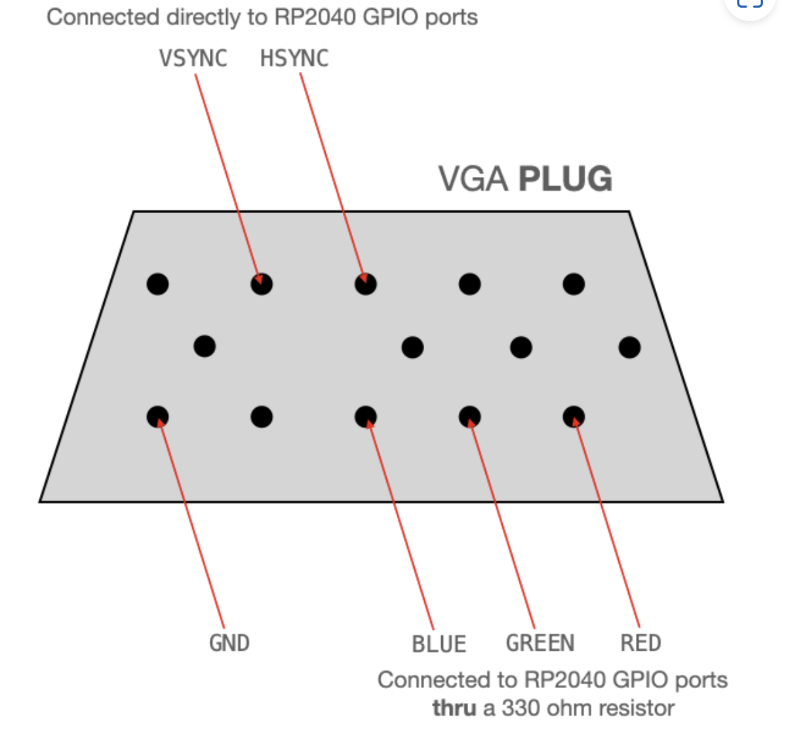
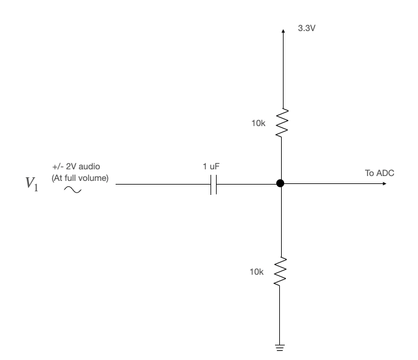

# Final Project Notebook

1. Core 0 computes the FFT. Core 1 blinks the LED, and display Spectrogram on VGA display.

2. The pixels will be colored according to the log of the magnitude of the FFT output. the spectrograms look nice with black for low magnitude, white for large magnitude, and a gradient of grayscale in between.

3. Can use 4 bit color. Use grayscal instead of RGB so more color can show

4. User Interface
    - clean screen
    - stop display
    - stop when fill the screen
    - change the draw speed

# Hardware

HARDWARE CONNECTIONS
- GPIO 16 ---> VGA Hsync
- GPIO 17 ---> VGA Vsync
- GPIO 18 ---> 330 ohm resistor ---> VGA Red
- GPIO 19 ---> 330 ohm resistor ---> VGA Green
- GPIO 20 ---> 330 ohm resistor ---> VGA Blue
- RP2040 GND ---> VGA GND
- GPIO 26 ---> Audio input [0-3.3V]

RESOURCES USED
- PIO state machines 0, 1, and 2 on PIO instance 0
- DMA channels 0, 1, 2, and 3
- ADC channel 0
- 153.6 kBytes of RAM (for pixel color data)

# Pico Datasheet

# VGA

# Biased high-pass filter

The audio output voltage is in the range -2V to 2V. We must bias/scale this to the range 0-3.3V for sampling by the ADC. We can do this with a biasing high-pass filter as shown below.

Note: If you aren't seeing anything on your spectrogram, check the audio input with the oscilloscope. Make sure the volume isn't turned down.

## Some Tools
[Online Tone Generator](https://www.szynalski.com/tone-generator/)

## Some Reference

[Audio Spectrogram](https://vanhunteradams.com/Spectrogram/Spectrogram.html)

[Start Code](https://people.ece.cornell.edu/land/courses/ece4760/PIC32/FFT_TFT_spectrum/TFT_FFT_ADC.c)

[Spectrogram - wiki](https://en.wikipedia.org/wiki/Spectrogram)

[Realtime Audio FFT to VGA Display with RP2040](https://vanhunteradams.com/Pico/VGA/FFT.html)

[VGA 8-bit color on RP2040](https://people.ece.cornell.edu/land/courses/ece4760/RP2040/C_SDK_vga256/index_vga_256.html)

[Cooley-Tukey FFT](https://vanhunteradams.com/FFT/FFT.html)

[quick log algorithm](http://graphics.stanford.edu/~seander/bithacks.html#IntegerLogLookup)

[quick log] https://stackoverflow.com/questions/11376288/fast-computing-of-log2-for-64-bit-integers
